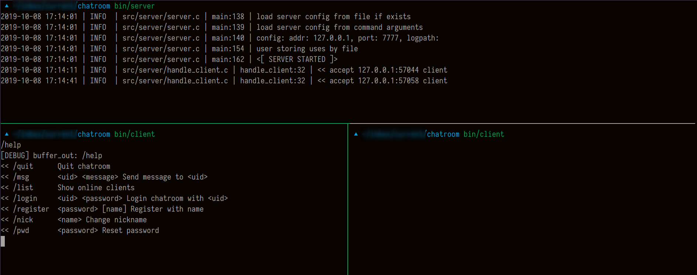

# chatroom

以 C 写的简单的聊天室（chatroom）。C/S 架构程序。一个服务端能够连接多个客户端。多个客户端之间能相互聊天。



## 功能

- 用户注册登入
- 接受多个客户端
- 命名和重名用户
- 发送私有消息
- 以 daemon 的方式运行后台
- 可以开启日志记录

## 编译

执行 GNU make

```sh
make # 编译 server 和 client
make server # 只编译 server
make client # 只编译 client
```

## 使用

```sh
$ bin/server -h
Usage: bin/server [options]
options:
        --help, -h
                show help information
        --config <filename>, -f <filename>
                specify configure file
        --bind_ip <ipaddress>, -i <ipaddress>
                specify server bind ip
        --port <port>, -p <port>
                specify server bind port
        --storage <type>, -s <type>
                specfiy storage type for storing register users
        --quiet, -q
                run as quiet mode
        --logpath <path>, -l <path>
                specify log path
        --daemon, -d
                run as daemon
```

```sh
$ bin/client -h
Usage: bin/client [options]
options:
        --help, -h
                show help information
        --config <filename>, -f <filename>
                specify configure file
        --server_ip <ipaddress>, -i <ipaddress>
                specify server ip
        --port <port>, -p <port>
                specify server p
```

### 客户端支持的命令

| Command       | Parameter             |                                     |
| ------------- | --------------------- | ----------------------------------- |
| /quit         |                       | Leave the chatroom                  |
| /register     | \<password\> [name]   | Register in chatroom                |
| /login        | \<uid\> \<password\>  | Log in chatroom                     |
| /nick         | \<name\>              | Change nickname                     |
| /msg          | \<uid\> \<message\>   | Send private message                |
| /list         |                       | Show active clients                 |
| /pwd          | \<password\>          | Change the password                 |
| /help         |                       | Show this help                      |

## 配置

`etc/server.conf`

```
# server address
server_address 127.0.0.1

# server port 
server_port 7000

# log file
log_file tmp/server.log

# storage type
storage_type file

#daemon
daemon 0
```

`etc/client.conf`

```
# server address
server_address = 127.0.0.1

# server port
server_port = 7777
```
